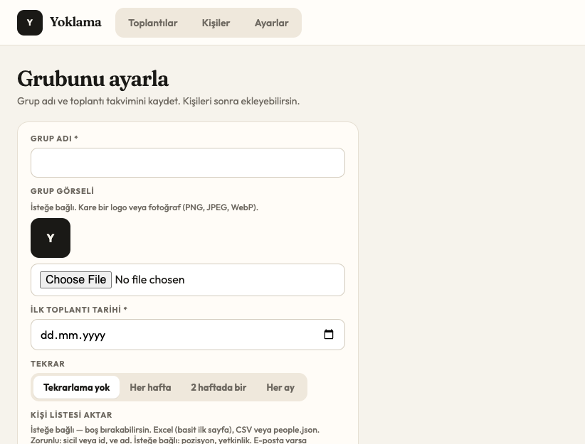
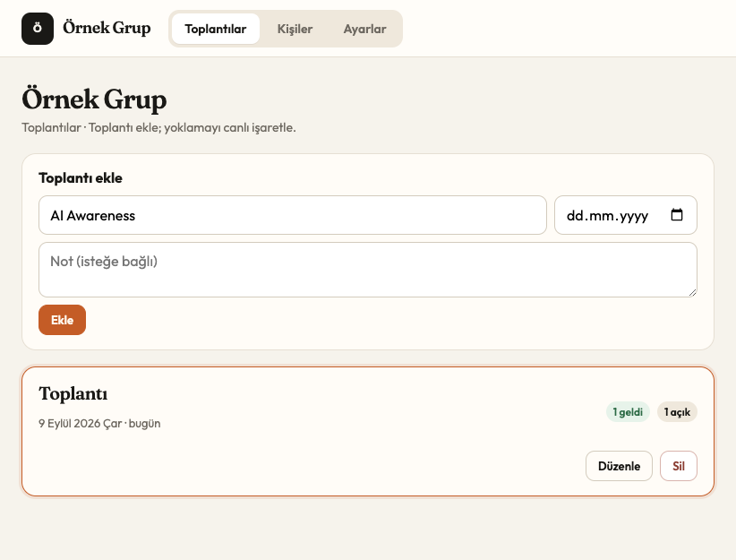
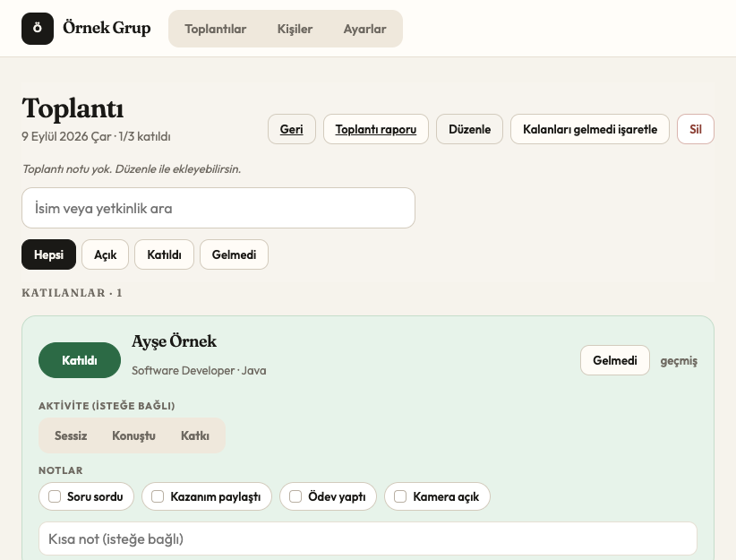
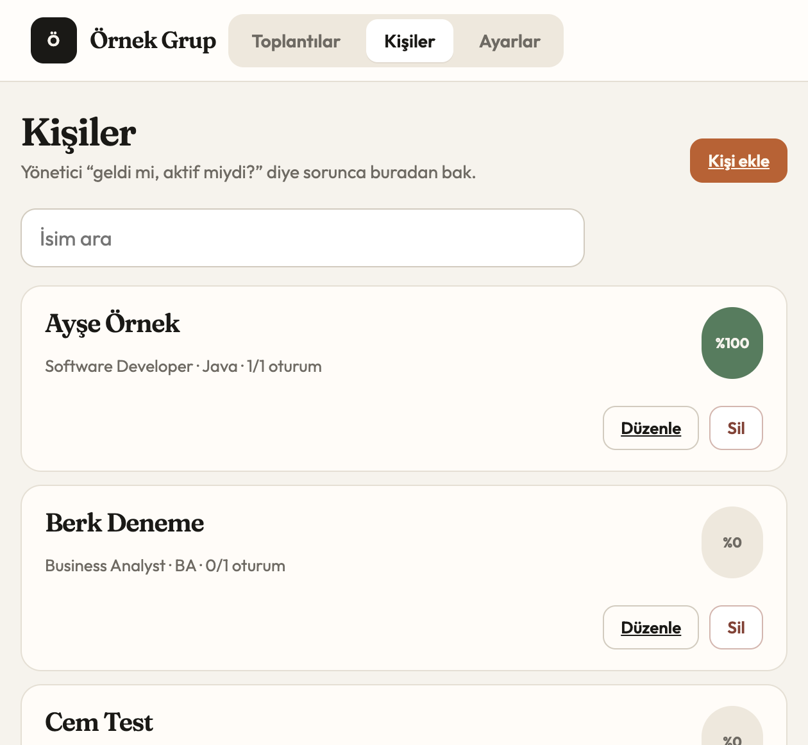
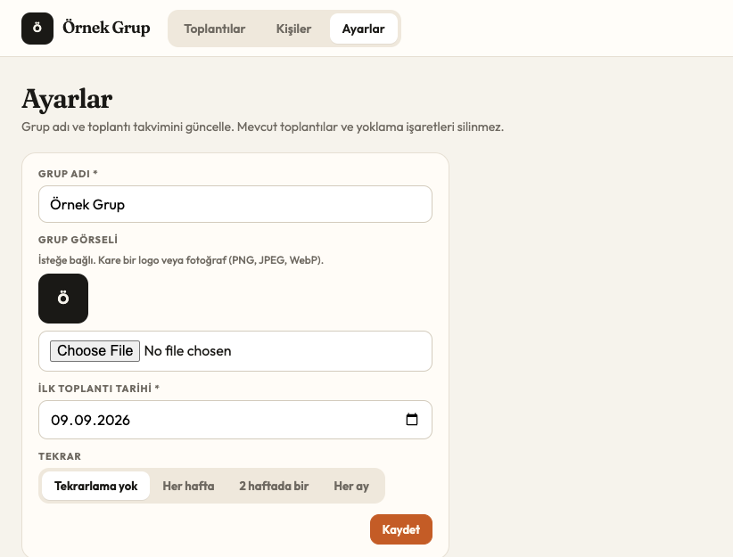

<p align="center">
  
</p>

<h1 align="center">Yoklama</h1>

<p align="center">
  <strong>Bir AI Champion, bir grup, bir dizüstü.</strong><br>
  Toplantıda isimleri canlı işaretle. Yönetici sorunca özeti kopyala.<br>
  Veri bu makinede kalır — sunucu yok, giriş yok, pip yok.
</p>

<p align="center">
  
  
  
</p>

---

## Ne işe yarar

Yoklama, toplantı sırasında yoklama tutmak için **yerel** bir web uygulamasıdır. Tarayıcıda açarsın, listeden **Katıldı** / **Gelmedi** işaretlersin, isteğe bağlı aktivite ve not eklersin.

- Tek grup, tek şampiyon, tek bilgisayar
- İlk açılışta kısa kurulum (grup adı, ilk tarih, tekrar)
- Excel / CSV / JSON ile kişi listesi aktarımı
- Canlı oturum, kişi geçmişi, yönetici özeti
- `git pull` senin `data/attendance.db` dosyanı silmez

Ekran görsellerindeki isimler örnektir (`Ayşe Örnek`, `example.com`). Gerçek sicil, ad veya e-posta git’e **konmaz**.

## Kurulum ve çalıştırma

Gereken tek şey **Python 3**. Ek paket yok; `pip install` yok.

**macOS / Linux**

```bash
git clone https://github.com/cagrigider/yoklama.git
cd yoklama
python3 app.py
```

Tarayıcıda aç:

```text
http://127.0.0.1:8765
```

Uygulama yalnızca `127.0.0.1` dinler. Aynı Wi-Fi’deki başka bir cihaz bu adresi açamaz; yoklama senin laptop’unda kalır.

Durdurmak için terminalde `Ctrl+C`.

Python sürümünü kontrol etmek için:

```bash
python3 --version
```

`python3` bulunamazsa macOS’ta Xcode Command Line Tools veya [python.org](https://www.python.org/downloads/) yeter.

> **Güncelleme:** Kod güncellemek `git pull` ile yapılır. Yerel veritabanın (`data/attendance.db`) git’te olmadığı için çekme işlemi yoklama işaretlerini silmez.

## İlk açılış

Boş bir veritabanında ilk ekran **Grubunu ayarla** sihirbazıdır. Toplantılar / Kişiler / Ayarlar, profil kaydedilene kadar kilitlidir.

1. **Grup adı** yaz (ör. `Grup 5`).
2. İstersen kare bir **grup görseli** seç (PNG, JPEG veya WebP, en fazla 150 KB).
3. **İlk toplantı tarihi**ni seç.
4. **Tekrar:** tekrarsız, her hafta, 2 haftada bir veya her ay. Tekrarlı seride **bitiş tarihi** gerekir.
5. İstersen kişi listesini burada aktar; boş bırakıp sonra da ekleyebilirsin.
6. **Kaydet ve devam et.**

Makinede zaten toplantı kaydı varsa sihirbaz atlanır; varsayılan bir profil yazılır.

<p align="center">
  
</p>
<p align="center"><em>Toplantılar — yeni toplantı ekle, düzenle veya sil.</em></p>

## Günlük kullanım

### Toplantılar

Ana sayfada seriden gelen ve senin eklediğin toplantılar listelenir. **Toplantı ekle** ile ekstra bir oturum açabilirsin. Karttaki **Düzenle** tarih/not değiştirir; **Sil** o toplantıyı (ve işaretlerini) kaldırır.

### Canlı yoklama

Toplantı kartına tıkla. Arama kutusundan isim veya yetkinlik süz. Her kişi için:

| Ne | Ne işe yarar |
| --- | --- |
| **Katıldı** | Oturuma geldi |
| **Gelmedi** | Gelmedi |
| **Sessiz / Konuştu / Katkı** | İsteğe bağlı aktivite |
| **Soru sordu, kazanım, ödev, kamera** | İsteğe bağlı notlar |
| **Kısa not** | Serbest metin |

İşaretlenenler üste alınır. Bitince **Kalanları gelmedi işaretle**. **Toplantı raporu** o günün özetini verir.

<p align="center">
  
</p>
<p align="center"><em>Canlı oturum — Katıldı / Gelmedi, aktivite ve notlar.</em></p>

### Kişiler

Listede katılım oranı görünür. **Kişi ekle** ile tek tek ekleyebilir, **Düzenle** / **Sil** ile güncelleyebilirsin. Bir kişinin **geçmiş** linki oturum oturum kaydı gösterir. Yönetici “geldi mi, aktif miydi?” diye sorunca buradan bakıp özeti kopyalarsın.

<p align="center">
  
</p>
<p align="center"><em>Kişiler — katılım oranı, arama, ekle / düzenle / sil.</em></p>

### Ayarlar

Grup adı, görsel, ilk tarih ve tekrarı sonradan değiştir. **Mevcut toplantılar ve yoklama işaretleri silinmez.** Aynı ekrandan kişi listesi de aktarılır.

<p align="center">
  
</p>
<p align="center"><em>Ayarlar — profil ve takvim; mevcut yoklama korunur.</em></p>

## Kişi listesi aktarma

Sihirbazda veya **Ayarlar**da Excel (`.xlsx`), CSV veya `people.json` seçip **Aktar**.

Aktarım **sicil**e göre ekler/günceller. Dosyada olmayan kişileri silmez. Hatalı dosyada hiçbir satır yazılmaz.

### Sütunlar

Zorunlu: **sicil** (veya `id`) ve **ad**.

| Alan | Kabul edilen başlık örnekleri |
| --- | --- |
| Sicil | `sicil`, `Sicil No`, `id` |
| Ad | `name`, `Adı Soyadı`, `ad` |
| Pozisyon | `position`, `Pozisyon` |
| Yetkinlik | `center`, `Yetkinlik Merkezi` |
| E-posta | `email`, `E-posta Adresi (İş)` — isteğe bağlı |

Excel **basit ilk sayfa** olmalı (paylaşılan veya satır içi metin). Makro, ekstra başlık satırı veya şifreli kitap reddedilir — o zaman CSV kaydedip tekrar dene. CSV UTF-8 (BOM olabilir).

### JSON örneği

Repodaki şablon: `seed/people.example.json`. Kendi listen için kopyala, `seed/people.json` yap, uygulamayı **bir kez** yeniden başlat. `people.json` gitignore’dadır — gerçek isimleri commit etme.

```json
[
  {
    "id": "10001",
    "name": "Örnek Kişi",
    "position": "Software Developer",
    "center": "Example",
    "email": "ornek@example.com"
  }
]
```

### CSV örneği

```csv
Sicil No,Adı Soyadı,Pozisyon,Yetkinlik Merkezi,E-posta Adresi (İş)
10001,Örnek Kişi,Software Developer,Example,ornek@example.com
```

## Veri nerede durur

| Dosya | İçerik |
| --- | --- |
| `data/attendance.db` | Grup profili, kişiler, toplantılar, işaretler |
| `seed/people.json` | İsteğe bağlı ilk yükleme listesi (gitignore) |

Yedek almak için `data/attendance.db` kopyalaman yeter.

## Git’e ne gitmez

Takip edilen ağaçta **gerçek isim, sicil veya e-posta yoktur**.

- `data/*.db` — yoklama verisi
- `seed/people.json` — gerçek liste
- Excel / CSV roster dosyaları

Örnek seed: `seed/people.example.json`.

## Geliştiriciler (isteğe bağlı)

Uygulama çalıştırmak için Node gerekmez. Arayüz regresyonu için Playwright vardır; **senin** `data/attendance.db` dosyana dokunmaz. Ayrı bir kopyayı `127.0.0.1:18765` üzerinde açar.

```bash
npm install
npx playwright install chromium
npx playwright test
```
