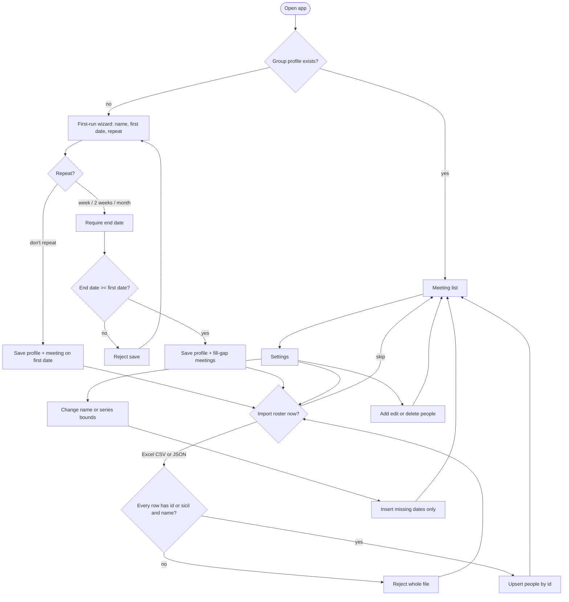
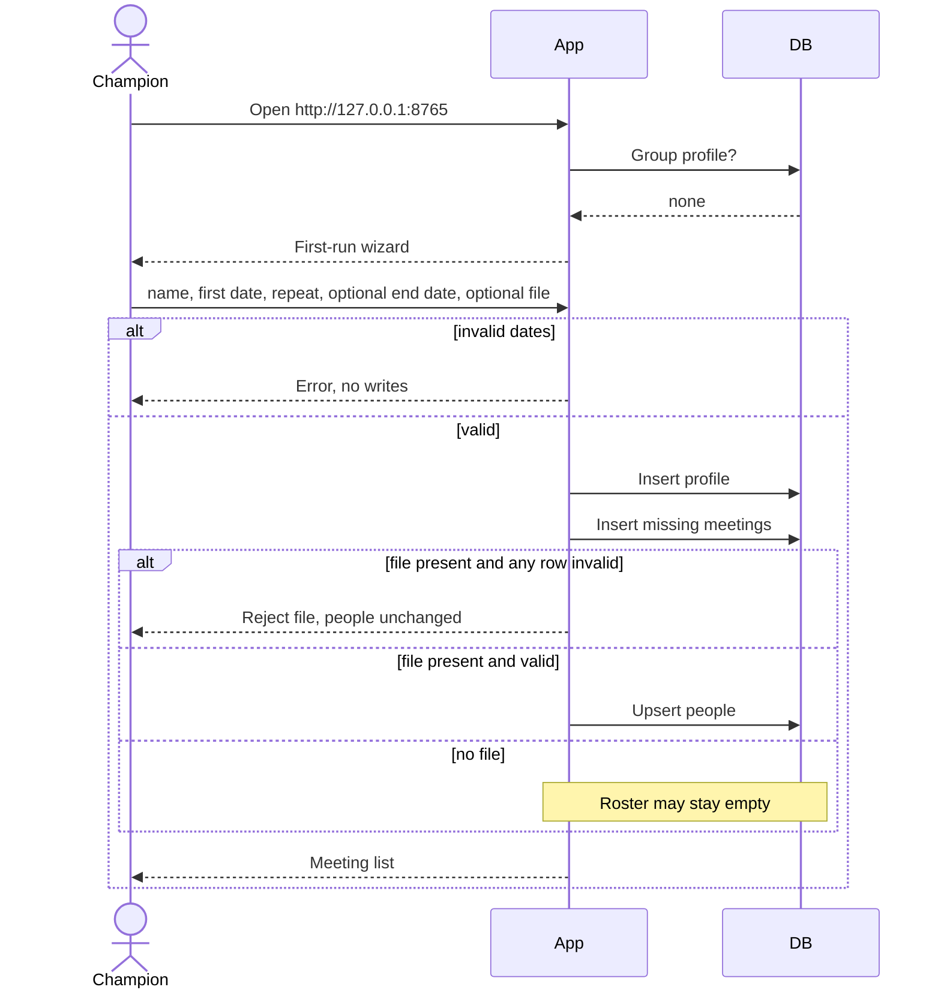
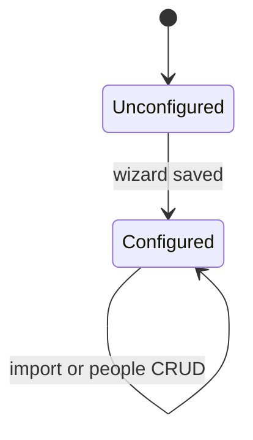
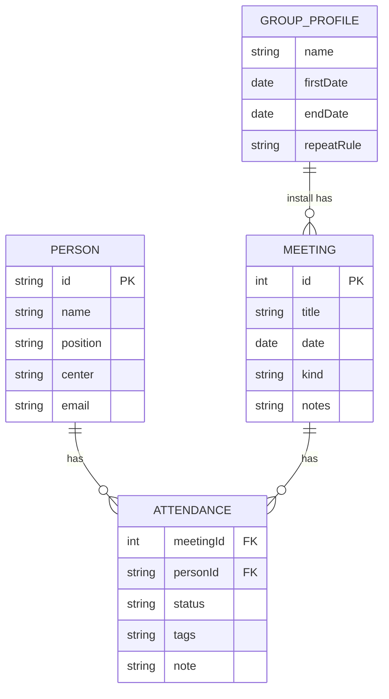

# Modeling diagrams — Yoklama shareable setup

| Field | Value |
|-------|-------|
| Date | 2026-09-08 |
| Slug | yoklama-setup |
| Locale | en |
| Source | BRD-yoklama-setup.en.md |
| Filename style | locale-suffixed (default; no `_memory/MEMORY.md`) |

Mermaid blocks are language-neutral. Operator confirmed all four drafts 2026-09-08. Primary sequence: empty-clone first-run.

## 1. Activity (process flow)

## 2. Sequence (empty clone first-run)

## 3. State (primary entity: GroupProfile)

No transition back to Unconfigured. Person delete removes that person and their attendance; it does not unconfigure the install.

## 4. ER (entities)

Cardinality: one GroupProfile per install. Delete person cascades that person's attendance. Generating a series never deletes Meeting or Attendance rows.

> Render note: open this file in a mermaid-compatible viewer (GitHub, VS Code mermaid extension, etc.) to see the diagrams drawn.
