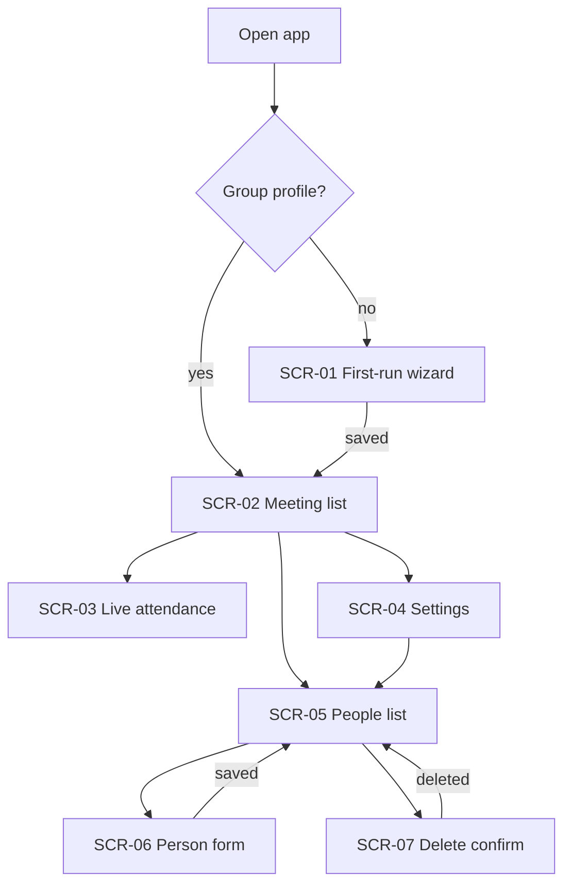

# UI/UX Screens — Yoklama shareable setup

| Field | Value |
|-------|-------|
| Date | 2026-09-08 |
| Slug | yoklama-setup |
| Source | FRD-yoklama-setup.en.md |
| Language | EN |
| HTML mockups | not produced |

Product UI copy stays Turkish at implementation time. This spec is English per BA UI/UX rules. Operator confirmed SCR-01 … SCR-07 on 2026-09-08.

## Screen: SCR-01 — First-run wizard

- **Purpose:** Configure an empty install (group name, series, optional roster) before the meeting list.
- **Fields:** group name* ; first date* ; repeat* (every week / every 2 weeks / every month / don’t repeat) ; end date* when repeat is not “don’t repeat” ; roster file optional (xlsx / csv / json).
- **Actions:** Save and continue ; skip import (leave roster empty).
- **States:** empty form ; date error (end before first, no writes) ; import rejected (any row missing id/sicil or name — people unchanged) ; success → meeting list.
- **Interactions:** “Don’t repeat” hides end date and creates only the first-date meeting. Valid date save persists the profile and fill-gap meetings even if a later import is rejected. Import does not roll back the profile.
- **Related FR:** FR-001, FR-003, FR-004, FR-005, FR-008, FR-010

## Screen: SCR-02 — Meeting list

- **Purpose:** After the app is configured, pick or add a meeting.
- **Fields:** meeting cards (title, date, counts) ; add-meeting form (title, date, notes) as today.
- **Actions:** open meeting ; add extra meeting ; open Settings ; open People.
- **States:** list (wizard “don’t repeat” still creates the first-date meeting, so empty list is rare) ; add-form validation as today.
- **Interactions:** Header shows the saved group name. First-run wizard does not appear. Existing extra-meeting create/edit/delete stays.
- **Related FR:** FR-002, FR-017, FR-019

## Screen: SCR-03 — Live attendance

- **Purpose:** Tick who joined or was absent; optional activity, tags, note.
- **Fields:** as current meeting roster (search, Katıldı, Gelmedi, activity, tags, note).
- **Actions:** as current meeting roster ; link to person history.
- **States:** unmarked / joined / absent rows ; save as today.
- **Interactions:** No setup fields. Position/center shown when present.
- **Related FR:** FR-017, FR-018

## Screen: SCR-04 — Settings

- **Purpose:** Change group name, series bounds, and import without wiping data.
- **Fields:** group name* ; first date* ; repeat* ; end date when repeating ; roster file optional.
- **Actions:** Save series (fill-gaps only) ; Import file ; open People.
- **States:** loaded from profile ; date error (no meeting deletes) ; import rejected whole file ; success (meetings only added).
- **Interactions:** Save never deletes existing meetings or marks. Shortening the end date does not remove already-created meetings.
- **Related FR:** FR-005, FR-006, FR-007, FR-009, FR-010

## Screen: SCR-05 — People list

- **Purpose:** See and maintain the roster.
- **Fields:** name ; center/position ; attendance counts as today.
- **Actions:** Add person ; Edit ; Delete ; open person history (AS-IS report).
- **States:** empty (allowed) ; list.
- **Interactions:** Empty roster is valid. History view remains the existing person report.
- **Related FR:** FR-011, FR-013, FR-017

## Screen: SCR-06 — Person form (add / edit)

- **Purpose:** Create or update one person.
- **Fields:** sicil/id* (disabled when editing) ; name* ; position ; center ; email optional (stored if provided, not required).
- **Actions:** Save ; Cancel.
- **States:** validation error if id or name missing ; success → people list.
- **Interactions:** Edit cannot change sicil/id. Wrong id → delete and add (SCR-07 then SCR-06 add).
- **Related FR:** FR-011, FR-012, FR-014, FR-018

## Screen: SCR-07 — Delete person confirm

- **Purpose:** Prevent accidental loss of attendance history.
- **Fields:** person name ; warning that all of their attendance marks will be removed.
- **Actions:** Confirm delete ; Cancel.
- **States:** dialog open ; after confirm → people list without that person.
- **Interactions:** Cancel leaves data unchanged. Confirm removes the person and their attendance rows.
- **Related FR:** FR-013

## Screen Flow

> HTML mockups were not generated.
